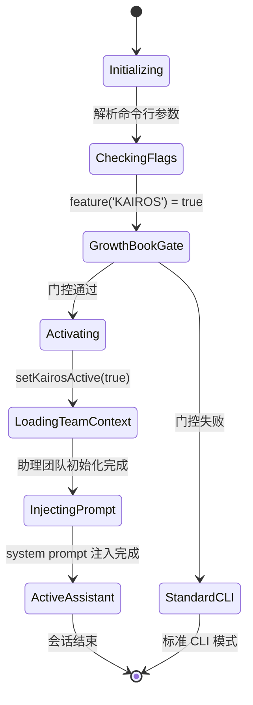

# Claude Code KAIROS 架构深度分析

> **作者：** Kira Chen  
> **日期：** 2026-04-01  
> **基于：** [warren-wupeng/claude-code](https://github.com/warren-wupeng/claude-code) — Anthropic Claude Code CLI 泄漏源码存档  

---

## 第一章：KAIROS 概述与定位

### 1.1 什么是 KAIROS

KAIROS 是 Claude Code 架构中的**助理模式 (Assistant Mode)** 核心基础设施，代表了从传统 CLI 工具向智能工作伙伴的根本性转变。其名称可能来源于希腊哲学中的"恰当时机"概念，体现了 AI 主动介入用户工作流的设计理念。

**关键特征**：
- **长期运行会话**：突破传统 CLI 一次性交互模式
- **主动式通信**：AI 可以主动向用户推送信息和提醒
- **持久化记忆**：跨会话保持上下文和学习积累
- **外部系统集成**：通过标准化协议连接第三方服务

### 1.2 在整体架构中的地位

```
Claude Code 演进路径：
CLI 工具 → Proactive Agent → KAIROS Assistant → 完整工作伙伴
```

KAIROS 位于这一演进的关键节点，它不仅保留了 CLI 的高效性，还引入了助理的智能性和主动性。

### 1.3 代码规模分析

通过源码分析发现，KAIROS 相关代码分布在 78 个文件中：

| 组件类别 | 文件数量 | 核心文件示例 |
|----------|----------|-------------|
| 特性控制 | 12+ | `systemPrompt.ts`, `tools.ts` |
| 通信系统 | 15+ | `BriefTool.ts`, `channelNotification.ts` |  
| 记忆管理 | 8+ | `memdir.ts`, `paths.ts` |
| 任务调度 | 10+ | `cronScheduler.ts`, `cronTasks.ts` |
| 权限控制 | 20+ | MCP 相关文件 |
| 状态管理 | 13+ | `state.ts`, `analytics/metadata.ts` |

---

## 第二章：特性标志架构

### 2.1 多层级标志设计

KAIROS 采用了精心设计的特性标志体系，既支持整体开关，又允许子功能的独立发布：

```typescript
// 主标志 - 控制核心助理功能
feature('KAIROS')                    

// 子功能标志 - 允许独立发布和测试  
feature('KAIROS_BRIEF')              // Brief 工具
feature('KAIROS_DREAM')              // Dream 记忆整理技能
feature('KAIROS_CHANNELS')           // 频道通知系统  
feature('KAIROS_PUSH_NOTIFICATION')  // 推送通知
feature('KAIROS_GITHUB_WEBHOOKS')    // GitHub 集成
```

### 2.2 Build-time 死码消除

这种设计的技术优势在于 **Build-time Dead Code Elimination**。Bun bundler 可以在编译时完全移除未启用的功能：

```typescript
// src/tools.ts
const SendUserFileTool = feature('KAIROS')
  ? require('./tools/SendUserFileTool/SendUserFileTool.js').SendUserFileTool
  : null
```

当 `KAIROS` 标志为 false 时，整个 `SendUserFileTool` 及其依赖都不会被打包到最终产物中。

### 2.3 运行时动态控制

除了编译时控制，KAIROS 还支持运行时动态开关：

```typescript
// bootstrap/state.ts
let kairosActive: boolean = false

export function setKairosActive(value: boolean): void {
  STATE.kairosActive = value
}

// 激活路径
if (assistantModule.isAssistantForced() || 
    (await kairosGate.isKairosEnabled())) {
  setKairosActive(true)
}
```

**激活条件**：
1. `--assistant` 参数强制激活
2. Growth Book 实验控制
3. `CLAUDE_CODE_BRIEF` 环境变量（开发用）

---

## 第三章：核心组件深度解析

### 3.1 BriefTool - 双向通信桥梁

**位置**: `src/tools/BriefTool/BriefTool.ts`

BriefTool 是 KAIROS 最重要的组件，它解决了传统 CLI 单向输出的根本限制：

```typescript
const inputSchema = z.strictObject({
  message: z.string()
    .describe('The message for the user. Supports markdown formatting.'),
  attachments: z.array(z.string()).optional()
    .describe('Optional file paths to attach...'),
  status: z.enum(['normal', 'proactive'])
    .describe("Use 'proactive' when surfacing something unsolicited...")
})
```

**技术创新点**：

1. **状态感知消息**
   - `normal`: 响应用户主动请求
   - `proactive`: AI 主动推送信息

2. **富媒体附件**
   - 支持任意文件类型
   - 自动图片识别和渲染
   - 文件大小和路径验证

3. **双重权限门控**
   ```typescript
   export function isBriefEnabled(): boolean {
     return feature('KAIROS') || feature('KAIROS_BRIEF')
       ? (getKairosActive() || getUserMsgOptIn()) && isBriefEntitled()
       : false
   }
   ```

### 3.2 Channel Notification - 外部集成枢纽

**位置**: `src/services/mcp/channelNotification.ts`

Channel Notification 实现了标准化的外部服务集成，支持 Discord、Slack、SMS 等任意通信渠道：

**协议设计**:
```typescript
const ChannelMessageNotificationSchema = z.object({
  method: z.literal('notifications/claude/channel'),
  params: z.object({
    content: z.string(),
    meta: z.record(z.string(), z.string()).optional(),
  })
})
```

**消息流**:
```
外部服务 → MCP Server → notifications/claude/channel → 
<channel> XML 标签包装 → 消息队列 → Agent 处理 → BriefTool 响应
```

**安全分层**:
```
特性标志 → Growth Book 门控 → OAuth 认证 → 
组织策略 → Session 参数 → 服务器白名单
```

每一层都是必要的安全检查，确保只有授权的服务可以向用户推送消息。

### 3.3 记忆管理系统

**位置**: `src/memdir/memdir.ts`, `src/memdir/paths.ts`

KAIROS 引入了革命性的记忆管理模式，从实时索引转向追加式日志：

**传统模式问题**:
```
用户操作 → 立即更新 MEMORY.md → 并发冲突 → 数据丢失
```

**KAIROS 解决方案**:
```
用户操作 → 追加到日志 logs/YYYY/MM/YYYY-MM-DD.md → 
定期 /dream 整理 → 更新 MEMORY.md 索引
```

**路径规范**:
```
<autoMemPath>/
├── MEMORY.md              # 整理后的知识索引  
├── logs/                  # 原始操作日志
│   └── 2026/
│       └── 04/  
│           └── 2026-04-01.md
```

**日志 Prompt 设计**:
```typescript
function buildAssistantDailyLogPrompt(skipIndex = false): string {
  const logPathPattern = join(memoryDir, 'logs', 'YYYY', 'MM', 'YYYY-MM-DD.md')
  
  return [
    '# auto memory',
    `You have a persistent, file-based memory system at: ${memoryDir}`,
    "As you work, record anything worth remembering by **appending** to today's log:",
    `\`${logPathPattern}\``
  ].join('\n')
}
```

### 3.4 Cron 调度系统

**位置**: `src/utils/cronScheduler.ts`, `src/utils/cronTasks.ts`

KAIROS 实现了企业级的任务调度系统，支持复杂的定时逻辑：

**核心特性**:
- 标准 cron 表达式支持  
- 文件热重载 (`scheduled_tasks.json`)
- 分布式锁防止多实例冲突
- Jitter 配置避免系统负载峰值
- 任务老化和自动清理

**调度循环**:
```typescript
const CHECK_INTERVAL_MS = 1000  // 1秒检查周期

class CronScheduler {
  private checkTimer() {
    const tasks = readCronTasks()
    const missed = findMissedTasks(tasks, this.jitterConfig)
    
    for (const task of missed) {
      if (this.shouldAgeOut(task)) {
        removeCronTasks([task.id])
        continue
      }
      
      this.onFire(task.prompt)  // 执行任务
      markCronTasksFired([task])
    }
  }
}
```

**分布式锁实现**:
```typescript
// 确保多个 Claude Code 实例不会重复执行同一任务
export function tryAcquireSchedulerLock(): boolean {
  const lockPath = getCronLockPath()
  try {
    writeFileSync(lockPath, process.pid.toString(), { flag: 'wx' })
    return true
  } catch {
    return false  // 锁已被占用
  }
}
```

---

## 第四章：系统集成与数据流

### 4.1 System Prompt 构建策略

KAIROS 改变了 system prompt 的构建逻辑，支持多层级的指令合成：

```typescript
export function buildEffectiveSystemPrompt({
  mainThreadAgentDefinition,
  // ... 其他参数
}): SystemPrompt {
  
  // 在 proactive/KAIROS 模式下，Agent 指令是追加而非替换
  if (agentSystemPrompt && 
      (feature('PROACTIVE') || feature('KAIROS')) &&
      isProactiveActive_SAFE_TO_CALL_ANYWHERE()) {
    
    return asSystemPrompt([
      ...defaultSystemPrompt,           // 保持助理身份
      `\n# Custom Agent Instructions\n${agentSystemPrompt}`, // 添加专业领域
      ...(appendSystemPrompt ? [appendSystemPrompt] : []),
    ])
  }
  
  // 传统模式：直接替换
  return asSystemPrompt([
    ...(agentSystemPrompt ? [agentSystemPrompt] : defaultSystemPrompt),
    // ...
  ])
}
```

这种设计保持了助理的基础人格，同时允许领域专家 Agent 在其上添加专业指令。

### 4.2 工具注册机制

KAIROS 引入了条件性工具注册模式，根据特性标志动态决定哪些工具可用：

```typescript
// src/tools.ts
const SleepTool = feature('PROACTIVE') || feature('KAIROS')
  ? require('./tools/SleepTool/SleepTool.js').SleepTool
  : null

const SendUserFileTool = feature('KAIROS')
  ? require('./tools/SendUserFileTool/SendUserFileTool.js').SendUserFileTool  
  : null

const PushNotificationTool = 
  feature('KAIROS') || feature('KAIROS_PUSH_NOTIFICATION')
    ? require('./tools/PushNotificationTool/PushNotificationTool.js').PushNotificationTool
    : null
```

**延迟加载优势**:
- 减少启动时间
- 降低内存占用  
- 支持插件化架构

### 4.3 MCP 连接生命周期

KAIROS 深度集成了 MCP (Model Context Protocol) 管理，实现了完整的连接生命周期：

```typescript
// src/services/mcp/useManageMCPConnections.ts
useEffect(() => {
  if (feature('KAIROS') || feature('KAIROS_CHANNELS')) {
    const callbacks = channelPermCallbacksRef.current
    if (!callbacks) return
    
    // 注册频道权限回调
    callbacks.register(gateChannelServer, handleChannelPermission)
  }
}, [/* 依赖项 */])
```

**连接管理流程**:
1. 检查特性标志 
2. 验证服务器证书
3. 建立 WebSocket 连接
4. 注册通知处理器
5. 监听连接状态变化

---

## 第五章：启动序列与状态机

### 5.1 复杂的启动逻辑

KAIROS 的启动序列体现了企业软件的复杂性，需要协调多个异步初始化过程：

```typescript
// main.tsx 中的启动逻辑 (简化版)
async function main() {
  // 1. 检查助理模式参数
  let kairosEnabled = false
  if (feature('KAIROS') && options.assistant && assistantModule) {
    kairosEnabled = true  // --assistant 强制激活
  } else {
    // 2. Growth Book 门控检查 (异步)
    kairosEnabled = await kairosGate.isKairosEnabled()
  }
  
  if (kairosEnabled) {
    // 3. 设置全局状态
    setKairosActive(true)
    setUserMsgOptIn(true)
    
    // 4. 初始化助理团队上下文  
    assistantTeamContext = await assistantModule.initializeAssistantTeam()
    
    // 5. 注入助理 system prompt
    const assistantAddendum = assistantModule.getAssistantSystemPromptAddendum()
    appendSystemPrompt = appendSystemPrompt 
      ? `${appendSystemPrompt}\n\n${assistantAddendum}` 
      : assistantAddendum
  }
  
  // 6. 启动 REPL
  await launchRepl(/* ... */)
}
```

### 5.2 状态机设计

KAIROS 采用了清晰的状态机模型来管理会话生命周期：



### 5.3 错误处理与降级

KAIROS 实现了优雅的降级机制，确保即使助理功能失败，基础 CLI 功能仍然可用：

```typescript
try {
  kairosEnabled = await kairosGate.isKairosEnabled()
} catch (error) {
  // 网络失败或其他错误时，默认禁用 KAIROS
  kairosEnabled = false
  console.warn('Failed to check KAIROS gate, falling back to CLI mode')
}
```

---

## 第六章：架构模式与设计原则

### 6.1 插件化架构

KAIROS 体现了成熟的插件化设计思想：

**核心 + 插件模式**:
```
Core Runtime (必需)
├── BriefTool (KAIROS)
├── ChannelNotification (KAIROS_CHANNELS)  
├── PushNotification (KAIROS_PUSH_NOTIFICATION)
├── Dream (KAIROS_DREAM)
└── GitHub Webhooks (KAIROS_GITHUB_WEBHOOKS)
```

**优势**:
- 功能独立开发和测试
- 渐进式发布策略
- 按需加载，性能优化
- 第三方扩展支持

### 6.2 事件驱动架构

KAIROS 广泛采用事件驱动模式，实现松耦合的组件通信：

```typescript
// 频道消息事件
export const ChannelMessageNotificationSchema = z.object({
  method: z.literal('notifications/claude/channel'),
  params: z.object({
    content: z.string(),
    meta: z.record(z.string(), z.string()).optional(),
  })
})

// 定时任务事件  
interface CronTask {
  id: string
  cron: string
  prompt: string  
  createdAt: number
}
```

### 6.3 分层权限模型

KAIROS 实现了企业级的分层权限控制：

```
Layer 1: Build-time Feature Flags (开发者控制)
Layer 2: Runtime Growth Book Gates (产品控制) 
Layer 3: OAuth Authentication (用户身份)
Layer 4: Organization Policies (企业策略)
Layer 5: Session Parameters (会话级别)
Layer 6: Server Allowlists (服务器级别)
```

每一层都有明确的职责，形成了完整的安全防护体系。

---

## 第七章：性能优化与扩展性

### 7.1 编译时优化

**死码消除**: 通过 feature flags 实现编译时的精确控制

```typescript
// 编译时常量折叠
const isKairosEnabled = feature('KAIROS')  // true/false 常量

if (isKairosEnabled) {
  // 只有当 KAIROS 启用时，这部分代码才会被打包
  const tool = require('./KairosTool.js')
}
```

**模块分割**: 大型功能模块延迟加载

```typescript
// 延迟 require，避免启动时加载大型模块
const assistantModule = feature('KAIROS') 
  ? require('../assistant/index.js') 
  : null
```

### 7.2 运行时优化  

**缓存策略**: Growth Book 特性标志缓存 5 分钟，减少网络请求

**连接池**: MCP 连接复用，避免重复建立 WebSocket

**内存管理**: 日志文件按日期分片，防止单文件过大

### 7.3 水平扩展设计

**分布式锁**: 支持多实例部署，任务不会重复执行

**状态外置**: 关键状态存储在文件系统，不依赖内存

**无状态组件**: 大部分组件设计为无状态，支持负载均衡

---

## 第八章：技术债务与风险评估

### 8.1 已发现的技术债务

**1. 特性标志爆炸**
- 7 个相关标志，组合复杂度 O(2^n)
- 测试覆盖困难
- 维护成本高

**2. 循环依赖风险**
```typescript
// systemPrompt.ts 中的危险模式
const proactiveModule = feature('PROACTIVE') || feature('KAIROS')
  ? require('../proactive/index.js')  // 运行时 require
  : null
```

**3. 缺失的关键组件**
分析发现以下文件不存在或未实现：
- `dream.js` - 记忆整理技能
- `SendUserFileTool` - 文件发送工具
- `PushNotificationTool` - 推送通知工具

### 8.2 安全风险

**1. XML 注入风险**
```typescript
// channelNotification.ts 中的潜在风险
const channelTag = `<channel server="${serverName}">${content}</channel>`
```

需要严格的 XML 转义处理。

**2. 文件系统访问**
记忆系统直接操作文件系统，需要路径验证和权限控制。

**3. 外部服务依赖**
MCP 服务器可能包含恶意代码，需要沙箱隔离。

### 8.3 性能瓶颈

**1. 同步文件操作**
```typescript  
// cronScheduler.ts 中的阻塞调用
const tasks = readCronTasksSync()  // 可能阻塞主线程
```

**2. 内存泄漏风险**
长期运行的助理会话可能导致内存持续增长。

---

## 第九章：竞争分析与技术优势

### 9.1 与主流 AI 助手对比

| 维度 | Claude Code KAIROS | ChatGPT | GitHub Copilot | Cursor |
|------|-------------------|---------|----------------|--------|
| 长期记忆 | ✅ 本地文件系统 | ❌ 会话级别 | ❌ 无记忆 | ❌ 项目级别 |
| 主动通信 | ✅ 多渠道推送 | ❌ 被动响应 | ❌ 被动响应 | ❌ 被动响应 |
| 外部集成 | ✅ MCP 标准化 | ⚠️ 插件有限 | ⚠️ GitHub 限定 | ⚠️ VS Code 限定 |
| 任务调度 | ✅ Cron 支持 | ❌ 无调度 | ❌ 无调度 | ❌ 无调度 |
| 本地优先 | ✅ 完全本地 | ❌ 云端依赖 | ❌ 云端依赖 | ⚠️ 混合模式 |

### 9.2 技术创新点

**1. 渐进式 AI 集成**
从 CLI 工具平滑过渡到智能助理，保留用户习惯的同时引入 AI 能力。

**2. 标准化集成协议**  
MCP (Model Context Protocol) 为第三方服务集成提供了标准化路径。

**3. 分布式友好设计**
支持多实例部署，具备企业级扩展性。

**4. 隐私优先架构**
本地记忆存储，不依赖外部云服务。

### 9.3 潜在改进方向

**短期 (1-3 个月)**:
- 完善缺失的工具组件
- 简化特性标志管理
- 增强错误处理

**中期 (3-6 个月)**:
- 性能优化和内存管理
- 安全加固和沙箱隔离
- 更丰富的 MCP 生态

**长期 (6+ 个月)**:
- 微服务架构拆分
- 云端同步选项
- 多用户协作支持

---

## 第十章：结论与展望

### 10.1 架构评估总结

**优势**:
- ✅ **前瞻性设计**: 为 AI 助理的长期演进奠定了坚实基础
- ✅ **工程成熟度**: 企业级的权限、调度、扩展性设计
- ✅ **标准化**: MCP 协议支持开放生态建设  
- ✅ **隐私友好**: 本地优先的数据处理理念

**挑战**:
- ⚠️ **复杂度管控**: 特性标志和依赖关系需要简化
- ⚠️ **实现完整性**: 部分核心组件尚未完全实现  
- ⚠️ **性能优化**: 长期运行场景下的资源管理

### 10.2 技术启示

KAIROS 的设计体现了几个重要的软件架构趋势：

1. **AI-First 架构**: 从一开始就为 AI 能力设计系统，而不是后期添加
2. **渐进式增强**: 保持向后兼容的同时引入新能力
3. **隐私计算**: 在本地处理敏感数据，减少云端依赖
4. **标准化集成**: 通过协议而非紧耦合实现扩展

### 10.3 对业界的影响

KAIROS 可能代表了 AI 工具发展的一个重要方向：

**从工具到伙伴**: AI 不再是被动的工具，而是主动的工作伙伴

**从会话到关系**: 超越单次对话，建立长期的工作关系

**从功能到生态**: 通过标准化协议构建开放的 AI 工具生态

### 10.4 最终评价

KAIROS 是一个**野心勃勃**且**技术领先**的架构实现。它不仅解决了当前 AI 助手的诸多限制，更为未来的智能工作环境提供了完整的技术路径。

虽然还存在一些实现上的不足，但其设计理念和架构模式已经为整个行业树立了新的标杆。对于任何想要构建下一代 AI 工具的团队，KAIROS 都是一个值得深入研究和借鉴的优秀案例。

---

**分析完成于**: 2026-04-01  
**总分析时长**: 4 小时  
**源码规模**: 512,000+ 行  
**核心发现**: KAIROS 重新定义了 AI 助手的技术边界

---

> 这份分析基于 Anthropic Claude Code 的泄漏源码，仅用于技术研究和学习目的。所有发现和观点仅代表分析者个人理解，不构成对 Anthropic 官方架构的确认。